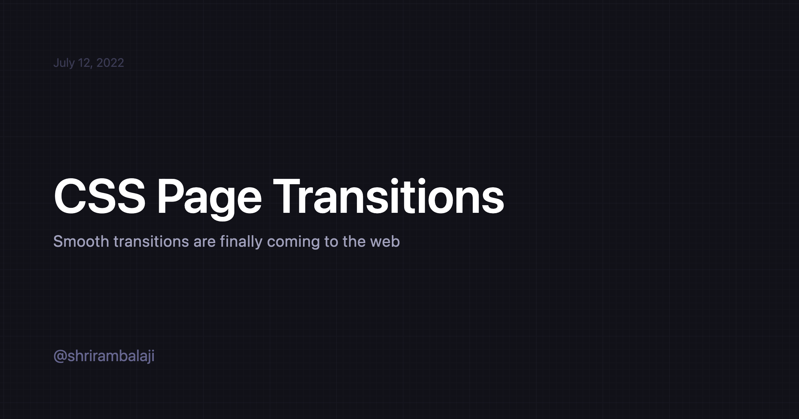

# og-shrirambalaji

Open Graph Image as a Service. Based on Vercel's implementation [og-image](https://github.com/vercel/og-image) & [og-dpnkr](https:/github.com/Deep-Codes/og-dpnkr/blob/main/README.md) with some minor tweaks.

> Serverless service that generates dynamic Open Graph images that you can embed in your <meta> tags. For each keystroke, headless chromium is used to render an HTML page and take a screenshot of the result which gets cached.

Supports the following query parameters:
| Parameter        | Type       | Description                                                | Required  |
|--------------   |----------- |------------------------------------------------------------|-----------|
| `title`         | string     | Title of the OpenGraph Image                               | Yes       |      
| `date`          | string     | Date to be shown on the top                                | No        |
| `subtitle`      | string     | Subtitle shown below title                                 | No        |
| `backgroundUrl` | string     | Background Image URL to replace the default background     | No        |
| `blur`          | boolean    | Denotes if the background should be blurred                | No        |
| `highlight`     | boolean    | Adds a highlight to the title                              | No        |

## Usage
 
**URL**: `/api/images?title=CSS Page Transitions&date=July 12, 2022&subtitle=Smooth transitions are finally coming to the web`

## Built with
- **Framework**: [Next.js](https://nextjs.org/)
- **Deployment**: [Vercel](https://vercel.com)
- **Styling**: [Tailwind CSS](https://tailwindcss.com/)
  
> NOTE: `chrome-aws-lambda` is a large dependency and will blow up your lambda size. It is recommended to deploy this service separately from your next app to avoid [exceeding the 50MB size limit for serverless functions.](https://github.com/vercel/community/discussions/103).